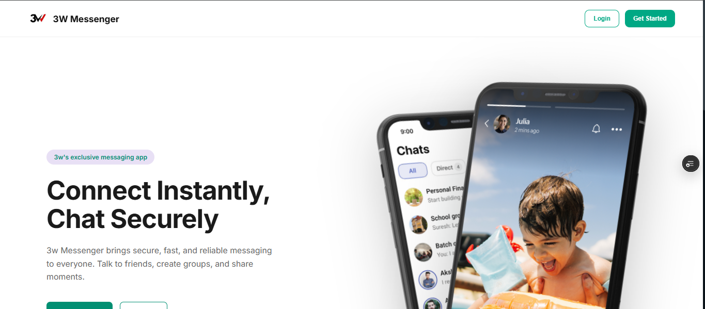
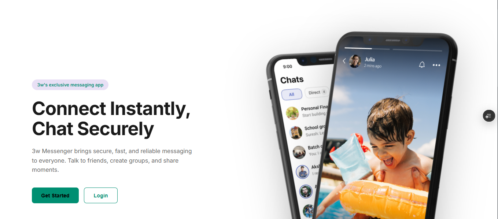
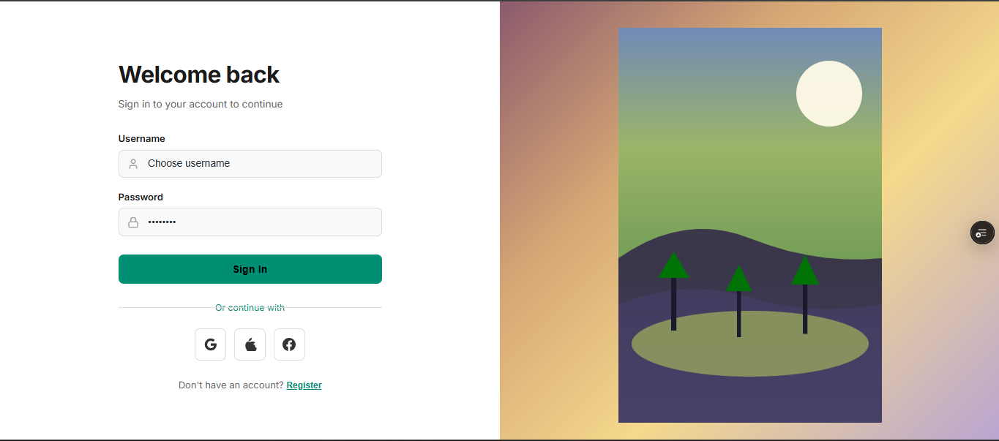
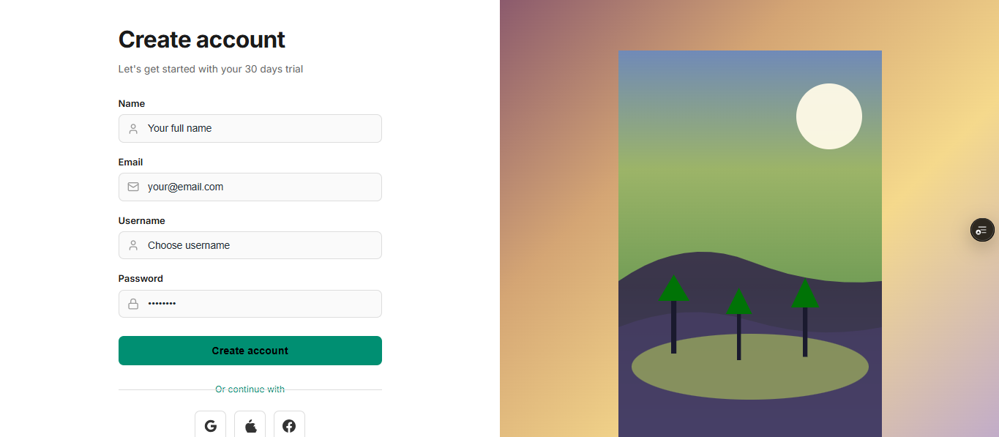
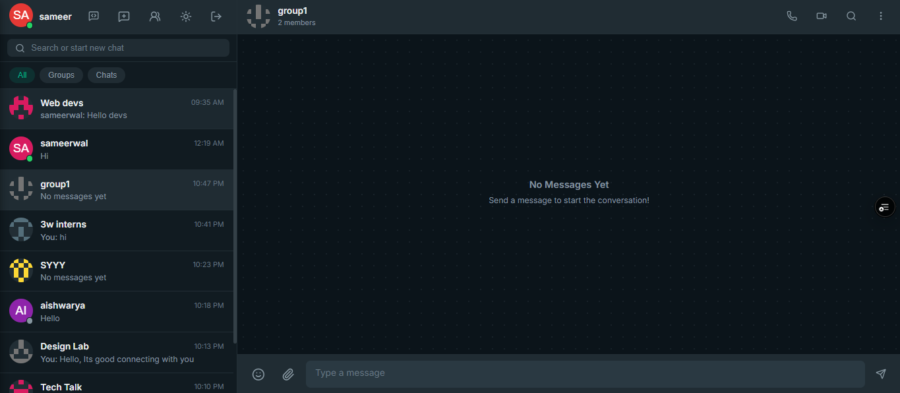

# 🚀 3W Messenger

A modern full-stack real-time messaging platform built with React, Vite, Express, MongoDB, and Socket.io.

## 📖 Overview

3W Messenger is a real-time communication platform that enables users to connect instantly through secure messaging, group chats, and live updates.

The project combines a modern React frontend with an Express backend, MongoDB database, and Socket.io-powered real-time communication layer.

---

## 🌐 Live Demo

### Frontend

https://sameers-real-time-chat-application.vercel.app/


---

## 📸 Project Screenshots

### Landing Page

> Add screenshot here




---

### Login Page

> Add screenshot here



---

### Registration Page

> Add screenshot here



---

### Chat Dashboard

> Add screenshot here



---

### Group Chat Interface

> Add screenshot here


---

### Mobile Responsive View

> Add screenshot here


---

## ✨ Features

### Authentication

* User Registration
* User Login
* JWT Authentication
* Protected Routes
* Session Persistence

### Messaging

* Real-Time Messaging
* Instant Message Delivery
* Socket.io Integration
* Live User Status
* Message Synchronization

### Chat Rooms

* Create Rooms
* Join Rooms
* Group Conversations
* Room Management
* Dynamic Room Listings

### User Experience

* Responsive Design
* Modern Landing Page
* Interactive UI Components
* Smooth Navigation
* Mobile-Friendly Interface

### Backend

* Express REST API
* MongoDB Database
* Mongoose ODM
* JWT Authorization
* Real-Time Socket Connections

---

## 🛠️ Tech Stack

### Frontend

* React 19
* Vite
* React Router DOM
* Lucide React
* CSS3

### Backend

* Node.js
* Express.js
* Socket.io
* JWT Authentication
* Bcrypt.js

### Database

* MongoDB
* Mongoose

### Deployment

* Vercel (Frontend)
* Render (Backend)

---

## 📂 Project Structure

```bash
3w-messenger/
│
├── backend/
│   ├── src/
│   │   ├── config/
│   │   ├── controllers/
│   │   ├── middleware/
│   │   ├── models/
│   │   ├── routes/
│   │   ├── sockets/
│   │   └── utils/
│   │
│   ├── server.js
│   └── package.json
│
├── frontend/
│   ├── src/
│   │   ├── assets/
│   │   ├── components/
│   │   ├── pages/
│   │   ├── hooks/
│   │   └── services/
│   │
│   ├── public/
│   └── package.json
│
└── README.md
```

---

## ⚙️ Installation

### Clone Repository

```bash
git clone <repository-url>
cd 3w-messenger
```

---

## Backend Setup

```bash
cd backend
npm install
```

Create a `.env` file:

```env
PORT=5000
MONGO_URI=your_mongodb_connection_string
JWT_SECRET=your_secret_key
FRONTEND_URL=http://localhost:5173
```

Start backend:

```bash
npm start
```

Development mode:

```bash
npm run dev
```

---

## Frontend Setup

```bash
cd frontend
npm install
```

Create a `.env` file:

```env
VITE_API_URL=http://localhost:5000/api
```

Start frontend:

```bash
npm run dev
```

---

## 🚀 Production Deployment

### Backend (Render)

Configure:

```env
MONGO_URI=your_mongodb_uri
JWT_SECRET=your_secret
NODE_ENV=production
FRONTEND_URL=your_vercel_url
```

---

### Frontend (Vercel)

Configure:

```env
VITE_API_URL=your_render_backend_url/api
```

---

## 🔌 API Endpoints

### Authentication

```http
POST /api/auth/login
POST /api/auth/register
POST /api/auth/guest
GET  /api/auth/me
```

### Rooms

```http
GET  /api/rooms
POST /api/rooms/group
POST /api/rooms/join
```

### Messages

```http
GET /api/messages/:roomId
```

---

## 🎯 Future Improvements

* Direct Messaging
* Message Reactions
* File Sharing
* Voice Messages
* Video Calling
* Push Notifications
* User Profiles
* Message Search

---

## 👨‍💻 Author

**Sameer Walikar**

Computer Engineering Student | Full Stack Developer

GitHub: [Add GitHub Link]

LinkedIn: [Add LinkedIn Profile Link]

Portfolio: [Add Portfolio Link]

---

## 📄 License

This project is intended for educational, portfolio, and demonstration purposes.
